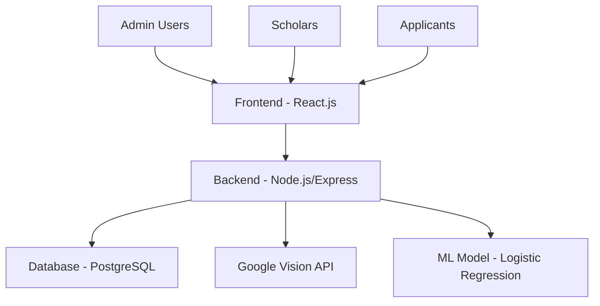

# My Portfolio
These are the systems and projects I have worked on, showcasing my skills in web development, full-stack applications, database management, and problem-solving. Each project demonstrates my experience in building functional, efficient, and user-friendly solutions.

- ### Barangay Geographical Information System 
- ### Charity First Foundation Inc. - Scholar Information System 
- ### Tracecrusade - Alumni Management System
- ### PLM Integrated Admission System (Law and Medicine) 
- ### PLM Admission Management System (Plmat, Clat, Cmat, and Graduate Schools) 

---

# Barangay Geographical Information System

A comprehensive web-based management system for Barangay 99, Zone 8, District 1 in Tondo, Manila. This system streamlines barangay operations, resident management, and service delivery through an intuitive admin panel.

## 🚀 Features

### 📊 Dashboard & Analytics
- **Population Overview**: Track total population, registered voters, and permanent residents
- **Demographic Data**: Gender distribution and age bracket summaries
- **Employment Statistics**: Monitor employment status across residents
- **Real-time Reports**: Visualize barangay data through comprehensive reporting

### 👥 Resident Management
- **Resident Information**: Complete resident profiles with personal details
- **Record Editing**: Update resident information including contact details and status
- **Categorization**: Filter residents by building, residency status, and voter status

### 📑 Document Services
- **Request Forms**: Generate barangay documents (clearances, certifications)
- **Request Tracker**: Monitor and manage document requests
- **Automated Document Generation**: Create official barangay documents with resident data

### ⚖️ Incident & Complaint System
- **Incident Reporting**: Formal incident documentation with detailed narratives
- **Complaint Management**: Structured complaint filing process
- **Case Tracking**: Monitor incident and complaint resolution status
- **Witness Management**: Record witness information for official cases

### 📢 Communication Tools
- **Announcement System**: Broadcast important information to residents
- **Targeted Messaging**: Send notifications to specific resident groups

### 🚨 Emergency Management
- **Equipment Inventory**: Track emergency response equipment
- **Responder Directory**: Manage emergency response personnel
- **GIS Integration**: Geographic information system for location-based services

## 🛠️ Prerequisites

- **React.js**
- **Node.js**
- **PostgreSQL 16**
- Modern web browser

## ⚡ Installation

1. Clone the repository
2. Configure database connection
3. Import initial database schema
4. Set up admin credentials
5. Deploy to web server

## 🔐 Admin Login

- Access the admin panel at `/admin`
- Use authorized credentials to log in
- Default access restricted to barangay officials

## 📋 System Modules

### 1. Dashboard
- Population statistics
- Employment status overview
- Age distribution analytics
- Quick access to all modules

### 2. Resident Information
- Complete resident database
- Search and filter capabilities
- Export functionality (PDF/Excel)
- Profile management

### 3. Request Management
- Document request processing
- Status tracking
- Automated clearance generation
- Purpose-based document issuance

### 4. Announcements
- Broadcast messaging
- Resident notifications
- Historical announcement tracking

### 5. Incident & Complaints
- Formal reporting system
- Case management
- Progress tracking
- Official documentation

### 6. GIS Integration
- Location-based services
- Spatial data management
- Mapping capabilities

## 🔧 Technical Features

- **Responsive Design**: Works on desktop and mobile devices
- **Secure Authentication**: Role-based access control
- **Data Export**: PDF and Excel reporting
- **Search Functionality**: Advanced resident search
- **Form Validation**: Client and server-side validation
- **Session Management**: JWT Secure user sessions

## 💾 Data Management

- Resident demographics tracking
- Document request history
- Incident and complaint records
- Announcement archives
- Emergency equipment inventory

## 👨‍💼 Admin Capabilities

- Manage resident records
- Process document requests
- Handle incidents and complaints
- Send official announcements
- Generate statistical reports
- Monitor barangay operations

## 📄 License

This system was developed for my thesis and was awarded the Best Presenter award at ICICyTA 2024.

---

**Barangay 99, Zone 8, District 1 | Tondo, Manila**  
*Empowering community management through technology*

---

# PLM Admission Management System

A comprehensive web-based admission platform for Pamantasan ng Lungsod ng Maynila (PLM). This system streamlines application processing across multiple programs with AI-powered document validation, secure applicant workflows, and role-based access management.

## 🚀 Features

### 🎓 Multi-Program Admission Support
- **CMAT**: College of Medicine Admission Test
- **CLAT**: College of Law Admission Test
- **PLMAT**: PLM Admission Test
- **Graduate Programs**: Advanced studies admission
- **Program-Specific Requirements**: Dynamic forms and document sets per program

### 👥 Role-Based Access Control
- **Applicant Portal**: Application submission, document upload, and status tracking
- **Admin Dashboard**: Review and validate applications
- **Role-Specific Interfaces**: UI varies based on user privileges

### 📄 Document Management & Validation
- Secure file uploads (PDF, PNG, JPG)
- AI-powered verification (CNN + Levenshtein algorithm)
- Fraud detection for manipulated documents
- Real-time document status (Pending / Verified / Rejected)

### 🤖 AI Integration
- CMAT AI Assistant: OpenAI-powered chatbot for applicant support
- Smart document analysis for credentials verification
- AI-assisted review for administrators

### 📊 Application Tracking & Reporting
- Real-time application progress
- Exportable reports (PDF, Excel, CSV)
- Admin analytics dashboard
- Document authenticity summaries

### 📧 Communication System
- Automated email notifications
- Google SMTP integration
- Application reminders and status alerts

## 🔐 Admin & User Access

### Applicant Access
- Register an account
- Submit applications
- Upload required documents
- Track application status
- AI-assisted support

### Admin Access
- Review and validate applications
- Generate reports
- Monitor analytics
- Manage user accounts

## 📋 System Modules

### 1. Application Dashboard
- Real-time application status
- Document submission tracker
- Application history
- Personal information management
  

### 2. Document Management
- Multi-file upload
- Document verification summary
- Authenticity scoring
- Submission monitoring

### 3. Admin Panel
- Application filtering and search
- Document review & verification
- Bulk operations
- User management

### 4. AI Assistant
- Real-time applicant support
- Explanation of requirements
- Status inquiries
- Intelligent chatbot guidance

### 5. Reporting & Analytics
- PDF and Excel report generation
- Application statistics
- Validation summaries
- Dashboard insights

### 6. Document Validation System
- Automated AI-based document checking
- Manual review interface
- Confidence scoring
- Flagging suspicious uploads

## 🔧 Technical Features
- Responsive design for desktop and mobile
- Secure authentication and role-based access control
- PDF/Excel reporting
- Advanced search functionality
- Client and server-side validation
- JWT session management

## 💾 Data Management
- Applicant records
- Document submission history
- Validation results and summaries
- Communication logs

## 👨‍💼 Admin Capabilities
- Manage applications
- Validate documents
- Generate reports and analytics
- Monitor system usage
- AI-assisted document review

## 📄 License
This system was developed for internship as Programmer Intern at Information and Communications Technology Office - Pamantasan ng Lungsod ng Maynila.

---

**Pamantasan ng Lungsod ng Maynila | Manila, Philippines**  
*Streamlining admissions through technology*

---

# Charity First Foundation Inc. - Scholar Information System

*A comprehensive scholarship management system built with modern web technologies*

## 🎯 Overview

The Charity First Foundation Inc. Scholar Information System is a robust platform designed to manage the entire scholarship lifecycle - from application to alumni tracking. The system incorporates AI-powered document verification and predictive analytics to enhance efficiency and decision-making processes.

## 🚀 Features

### 📋 Three Main Modules

#### 1. **Applicant/Application Module**
- **Online Application Portal**: Complete digital scholarship application process
- **Document Upload & Management**: Secure file upload with validation
- **OCR Document Verification**: Automated document processing using Google Vision API
- **Application Status Tracking**: Real-time application progress monitoring
- **Requirements Checklist**: Guided document submission process

#### 2. **Scholar Side Module**
- **Personal Dashboard**: Scholar profile and academic overview
- **Violation Tracking**: Record and monitor scholar infractions
- **Community Service Log**: Track and manage service hours
- **Consultation Forms**: Semestral academic consultation
- **Grade Submission**: Automated grade reporting and validation
- **Password Management**: Secure account management

#### 3. **Admin Side Module**
- **Application Review**: Comprehensive applicant evaluation
- **Scholar Management**: Complete scholar lifecycle management
- **Analytics Dashboard**: Population statistics and course summaries
- **Violation Monitoring**: Track and manage scholar compliance
- **Report Generation**: Export data to PDF and Excel formats
- **User Management**: Admin and scholar account administration

## 🛠️ Technology Stack

### Frontend
- **React.js** - Modern, component-based UI framework
- **CSS3 & Styled Components** - Responsive and modern UI design
- **State Management** - Context API and React Hooks
- **Form Handling** - Advanced form validation and management

### Backend
- **Node.js** - Scalable server-side runtime
- **Express.js** - Web application framework
- **RESTful APIs** - Structured API architecture
- **JWT Authentication** - Secure token-based authentication

### Database
- **PostgreSQL** - Robust relational database management
- **Advanced Queries** - Complex data relationships and reporting
- **Data Integrity** - ACID compliance and transactions

### AI & Machine Learning
- **Google Vision OCR** - Automated document processing and verification
- **Logistic Regression Algorithm** - Predictive analytics for applicant evaluation
- **Data Analytics** - Scholarship performance and retention predictions

### This is a CLIENT-BASED system developed for Charity First Foundation Inc. to streamline their scholarship management operations and enhance their service delivery to scholars and applicants.

## 🔧 System Architecture

---

# Tracecrusade - Alumni Management System

A comprehensive web-based alumni management system for Sacred Heart of Jesus Catholic School, designed to track and manage alumni information with secure authentication and dynamic content management.

## 🚀 Features

### 🔐 Secure Authentication System
- **Admin Login** with CAPTCHA verification
- Secure session management
- Role-based access control

### 📊 Alumni Information Management
- Complete alumni profiles with personal and academic details
- Advanced search and filtering capabilities
- Alumni data categorization by:
  - Present Location
  - Academic Strand
  - Employment Sector
  - Type of Employment

### 🖼️ Slideshow Management
- Dynamic image upload and management
- Frontend slideshow display
- Easy content rotation and updates
- Responsive image handling

### 📈 Dashboard Analytics
- Comprehensive alumni overview
- Statistical data presentation
- Quick access to management features

## 🛠️ Technology Stack

### Backend
- **PHP** - Server-side scripting
- **MySQL** - Database management
- **phpMyAdmin** - Database administration

### Frontend
- **HTML5** - Markup language
- **CSS3** - Styling and layout
- **JavaScript** - Client-side functionality
- **Responsive Design** - Mobile-friendly interface

### Security Features
- **CAPTCHA Integration** - Bot prevention
- **Secure Sessions** - User authentication
- **Input Validation** - Data integrity
- **SQL Injection Protection** - Database security

## 📋 System Modules

### 1. Alumni Management
- Complete alumni database
- Advanced search functionality
- Filter by location, strand, sector, and employment
- Export capabilities

### 2. Slideshow Management
- Image upload and organization
- Display order management
- Frontend presentation control
- Content rotation settings
  

## 💾 Database Structure

### Main Tables
- `admin_users` - Administrator accounts
- `alumni` - Alumni personal and academic information
- `slideshow` - Image management for frontend display
- `sessions` - User session management

### Alumni Data Fields
- Email Address
- Personal Details (First Name, Middle Name, Last Name)
- Contact Information
- Present Location and Address
- Academic Strand
- Years of Enrollment
- Extracurricular Activities
- Employment Information

## ⚡ Installation & Setup

### Prerequisites
- Web server with PHP support (Apache)
- MySQL database
- phpMyAdmin for database management

## 🔐 Admin Access

### Login Details
- **Security**: CAPTCHA-protected login
- **Features**: Role-based access to all management functions

## 🌐 Live Deployment

The system is currently deployed and accessible at:  
**https://tracedcrusade.com/LandingPage.php**

### Deployment Features
- **Production Environment** with optimized performance
- **Secure HTTPS** connection
- **Regular Backups** of alumni data
- **Mobile Responsive** design
- **Cross-browser Compatibility**

## 📊 Data Management

### Alumni Information Tracking
- Personal contact details
- Academic history and achievements
- Career and employment data
- Location and demographic information

### Slideshow Content
- Dynamic image rotation
- Easy content updates
- Multiple image format support
- Optimized loading performance

## 🔒 Security Measures

- **CAPTCHA Protection** on login forms
- **Password Encryption** using secure hashing
- **SQL Injection Prevention** through prepared statements
- **XSS Protection** with input sanitization

## 📄 License

This system was developed for Sacred Heart of Jesus Catholic School to efficiently manage alumni relationships and school communications.

Additionally, this is a commission-based system made for SHJCS Students.

